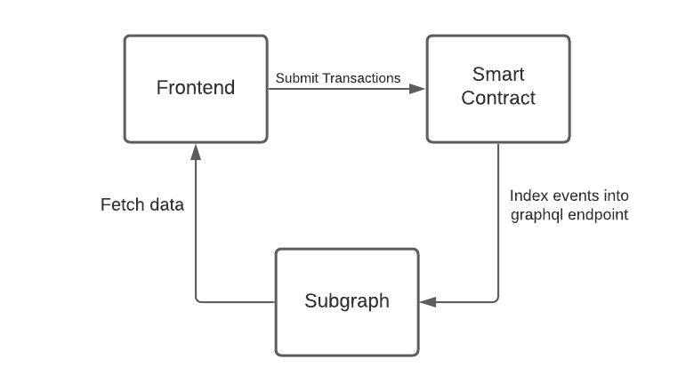

<p align="center">
    
<p>

# Non Fungible Time

Mint and purchase NFTs representing time for performing freelance services and other use cases. Time NFTs can represent an on-chain attestation of contributions, and a way for organizations to recruit talent for specialized needs.

While freelance services is the initial use case for Non Fungible Time, this primitive can be extended to other use cases, such as reservations, asset ownership, and autonomous on-chain agreements.

## Contents

1. [Project Details](#about)
   - [About](#project-description)
   - [Infrastructure](#infrastructure)
   - [Buidling](#buidling)
   - [Collection Ownership](#collection-ownership)
2. [Smart Contracts](#smart-contracts)
   - [NonFungibleTimeCollection](#NonFungibleTimeCollection)
   - [SvgGenerator](#svgGenerator)
3. [Frontend](#frontend)
4. [Subgraph](#subgraph)

## Project Details

### About

Time NFTs are a way for users to mint and own NFTs representing their time. Each NFT has customizable fields which are stored as on-chain metadata, and have a dynamic animated representation. Time NFTs allow uders to take ownership of their time through collecting, sharing, monetizing, or creating unique use cases.

### Infrastructure

<p align="center">
    
<p>

This diagram lays out the basic project structure. Smart contracts were developed using [hardhat](https://github.com/nomiclabs/hardhat). [Typechain](https://github.com/dethcrypto/TypeChain) is used to generate a typesafe ethers sdk for interacting with the smart contracts, and [Web3React](https://github.com/NoahZinsmeister/web3-react) is used to handle wallet connections and transaction signing.

### Buidling

Given the modular nature of smart contracts, Time NFTs can be integrated, enhanced, or forked by anyone. The sections below will cover the [smart contract](#smart-contract), [data](#subgraph), and [frontend](#frontend) components of the Time NFT project. See [contributing](CONTRIBUTING.md) for more info on joining the Newt community to build with Time NFTs.

### Collection Ownership

On launch the Time NFT collection contract will be launched as a proxy, owned be a multisig of the core team members. The contract owner has the ability to:

- Approve or revoke tokens as accepted forms of payment
- Set the address of the SvgGenerator contract
- Update the implementation contract

The collection owner does not have the ability to:

- Coopt, affect or otherwise move funds from any user of the system
- Burn user NFTs or prevent users from interacting with the collection contract

<br />

## Smart Contracts

The smart contracts store the NFT collection (ERC-721) on the blockchain - with the reference implementation being deployed to the Polygon network. This package uses the hardhat framework for contract development and deployment.

The [NonFungibleTimeCollection.sol](https://github.com/WeAreNewt/NonFungibleTime/blob/main/packages/contracts/contracts/NonFungibleTimeCollection.sol) contract defines the Time NFT collection

<details>
<summary>Contract Functions</summary>

#### mint()

**`function mint(string memory name, string memory description, string memory work, uint256 availabilityFrom, uint256 availabilityTo, uint256 duration, uint256 royaltyBasisPoints)`**

Mints a new token with the given parameters.

|      Parameter Name      |  Type   |                                     Description                                     |
| :----------------------: | :-----: | :---------------------------------------------------------------------------------: |
|        **`name`**        | string  |                            Name of the NFT being minted.                            |
|    **`description`**     | string  |                        Description of the NFT being minted.                         |
|      **`category`**      | string  |         Category of service that will be completed by the NFT being minted          |
|  **`availabilityFrom`**  | uint256 |  Unix timestamp indicating start of availability. Zero if there is no lower bound.  |
|   **`availabilityTo`**   | uint256 |   Unix timestamp indicating end of availability. Zero if there is no upper bound.   |
|      **`duration`**      | uint256 |    The total time tokenized within the availability range. Measured in seconds.     |
| **`royaltyBasisPoints`** | uint256 | The royalty percentage measured in basis points. Each basis point represents 0.01%. |

| Returns |  Type   |      Description      |
| :-----: | :-----: | :-------------------: |
|    0    | uint256 | tokenId of minted NFT |

#### buyToken()

**`function buyToken(uint256 tokenId)`**

Purchases token based on the provided tokenID.

| Parameter Name | Type    | Description                             |
| -------------- | ------- | --------------------------------------- |
| **`tokenId`**  | uint256 | The tokenID of the NFT being purchased. |

#### changeTokenBuyingConditions()

**`function changeTokenBuyingConditions(uint256 tokenId, address currency, uint256 price, address allowedBuyer, bool forSale)`**

Changes the price and currency of the token with the provided tokenID.

|   Parameter Name   |  Type   |                                          Description                                          |
| :----------------: | :-----: | :-------------------------------------------------------------------------------------------: |
|   **`tokenId`**    | uint256 |                                TokenID of the NFT being sold.                                 |
|   **`currency`**   | address | Address of the ERC-20 currency to be used for payment. Use address(0) to set native currency. |
|    **`price`**     | uint256 |                                 Price of the NFT being sold.                                  |
|   **`forSale`**    |  bool   |                        Boolean indicating whether the NFT is for sale.                        |
| **`allowedBuyer`** | address |  Address of the buyer to avoid frontruns. Use address(0) to enable everyone to buy the NFT.   |

#### redeem()

**`function redeem(uint256 tokenId)`**

Redeems the token with the provided tokenID.

| Parameter Name |  Type   |            Description             |
| :------------: | :-----: | :--------------------------------: |
| **`tokenId`**  | uint256 | TokenID of the NFT being redeemed. |

#### toggleCurrencyAllowance()

**`function toggleCurrencyAllowance(address currency)`**

Toggle for the allowance of the given currency (ERC-20) as a payment token. Can only called by contract owner.

| Parameter Name |  Type   |                               Description                               |
| :------------: | :-----: | :---------------------------------------------------------------------: |
| **`currency`** | address | The address of the ERC-20 currency. Use address(0) for native currency. |

#### tokenURI()

**`function tokenURI(uint256 tokenId)`**

Returns the URI (on-chain SVG) of the token with the provided tokenID

| Parameter Name |  Type   |       Description       |
| :------------: | :-----: | :---------------------: |
| **`tokenId`**  | uint256 | The tokenID of the NFT. |

#### tokens()

**`function tokena(uint256 tokenId)`**

Returns token object for a specified

| Parameter Name |  Type   |       Description       |
| :------------: | :-----: | :---------------------: |
| **`tokenId`**  | uint256 | The tokenID of the NFT. |

| Returns |  T ype  |                                                    Description                                                    |
| :-----: | :-----: | :---------------------------------------------------------------------------------------------------------------: |
|    0    | uint256 |                Unix timestamp indicating start of availability. Zero if does not have lower bound.                |
|    1    | uint256 |                 Unix timestamp indicating end of availability. Zero if does not have upper bound.                 |
|    2    | uint256 |          The actual quantity of time you are tokenizing inside availability range. Measured in seconds.           |
|    3    | uint256 |                                   Price to purchase NFT, in `currency` decimals                                   |
|    4    | uint256 |                The royalty percentage measured in basis points. Each basis point represents 0.01%.                |
|    5    | address |                                           The address of token minter.                                            |
|    6    | address |                          The address which receives royalty payout from secondary sales.                          |
|    7    | address |                The address of payment toke. Use address(0) for native currency (ETH, MATIC, etc.).                |
|    8    | address | Address approved to purchase this NFT if reserved for a single buyer. address(0) enables everyone to buy the NFT. |
|    9    |  bool   |                             A boolean representing if the token was redeemed or not.                              |
|   10    |  bool   |                                A boolean indicating if the NFT is for sale or not.                                |
|   11    | string  |                                                 Name of the NFT.                                                  |
|   12    | string  |                                              Description of the NFT.                                              |
|   13    | string  |                           Category label, defines the type of service being tokenized.                            |

</details>

The [SvgGenerator.sol](https://github.com/WeAreNewt/NonFungibleTime/blob/main/packages/contracts/contracts/SvgGenerator.sol) generates and stores the on-chain svg for each NFT, which is updated once an NFT is redeemed

To generate contract abis and typechain artifacts:

```sh
npm install
npx hardhat compile
```

[More Info](https://github.com/WeAreNewt/NonFungibleTime/blob/main/packages/contracts/README.md)

<br />

## Frontend

Main features of the frontend are creating, discovering, purchasing, and redeeming time NFTs

Frontend is build with React + TailwindCSS

[More Info](https://github.com/WeAreNewt/NonFungibleTime/blob/main/packages/frontend/README.md)

<br />

## Subgraph

The subgraph indexes data and provides access to a graphQL endpoint from blockchain data

There is a corresponding subgraph for each network the collection contract is deployed to

The playground links below allow you to view and query the subgraph schema directly from your browser and provide the links for the api endpoint:

- [Mumbai Subgraph](https://thegraph.com/hosted-service/subgraph/wearenewt/non-fungible-time-mumbai)

[More Info](https://github.com/WeAreNewt/NonFungibleTime/blob/main/packages/subgraph/README.md)
