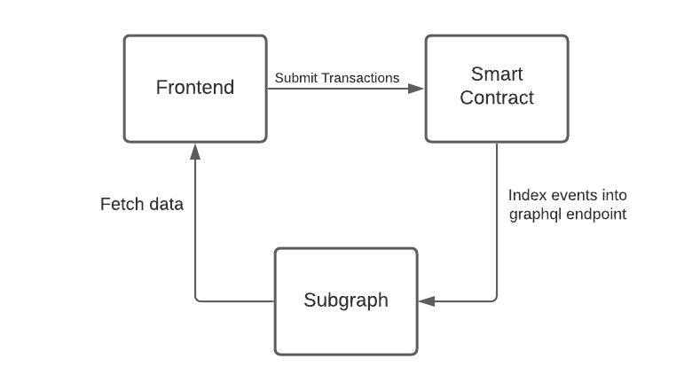

# Development

```
npm install
npm start
```

## The Circle Of Life

<p align="center">
    
<p>

## Subgraph Changes

To update the subgraph schema, in the `packages/frontend` directory run:

```
npm run subgraph:codegen
```

And update queries in `src/lib/queries.graphql`

## Smart Contract Changes

To generate new typechain facts, in the `packages/contracts` directory run:

```
npm i
npm run compile
```

Then copy `packages/contracts/typechain/NonFungibleTimeCollection.d.ts` into `packages/frontend/src/lib/helpers/NftCollection/typechain/NonFungibleTimeCollection.d.ts`

and `packages/contracts/typechain/factories/NonFungibleTimeCollection__factory.d.ts` into `packages/frontend/src/lib/helpers/NftCollection/typechain/factory/packages/contracts/typechain/factories/NonFungibleTimeCollection__factory.d.ts`

Then update `packages/frontend/src/lib/helpers/NftCollection/index.tsx` to call the updated smart contract interface
