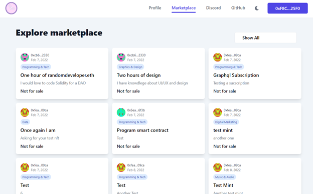

# Market

### Marketplace

**Need services?** Search the marketplace to fill your requirements.

* Navigate - Sort the offerings by category
*   Explore - Choose between a selection of jobs4

    * Date
    * Name
    * Description
    * Price / Status

### Technical Method


Purchase a token based on the provided tokenID.


#### buyToken()

**`function buyToken(uint256 tokenId)`**

| Parameter Name | Type    | Description                             |
| -------------- | ------- | --------------------------------------- |
| **`tokenId`**  | uint256 | The tokenID of the NFT being purchased. |


Toggle for the allowance of the given currency (ERC-20).


**toggleCurrencyAllowance()**

**`function toggleCurrencyAllowance(address currency)`**

| Parameter Name |   Type  |                               Description                               |
| :------------: | :-----: | :---------------------------------------------------------------------: |
| **`currency`** | address | The address of the ERC-20 currency. Use address(0) for native currency. |


Retrieves the royalty information of the NFT with the provided tokenID.


#### royaltyInfo()

**`function royaltyInfo(uint256 tokenId, uint256 salePrice)`**

|  Parameter Name |   Type  |                         Description                        |
| :-------------: | :-----: | :--------------------------------------------------------: |
|  **`tokenId`**  | uint256 |                   The tokenID of the NFT.                  |
| **`salePrice`** | uint256 | The price of the NFT that is used for royalty calculation. |


Checks if the contract supports the specified interface.


#### supportsInterface()

**`function supportsInterface(bytes4 interfaceId)`**

|   Parameter Name  |  Type  |                        Description                       |
| :---------------: | :----: | :------------------------------------------------------: |
| **`interfaceId`** | bytes4 | The interface ID of the interface that you are querying. |


Returns the URI of the token with the provided tokenID


#### tokenURI()

**`function tokenURI(uint256 tokenId)`**

|   Parameter Name   |   Type   |       Description       |
| :----------------: | :------: | :---------------------: |
| **Parameter Name** | **Type** |     **Description**     |
|    **`tokenId`**   |  uint256 | The tokenID of the NFT. |


Transfers the given amount of the provided currency from sender to receiver.


#### \_transferCurrency()

**`function _transferCurrency(address sender, address payable receiver, address currency, uint256 amount)`**

| Parameter Name |   Type  |                                Description                                |
| :------------: | :-----: | :-----------------------------------------------------------------------: |
|  **`sender`**  | address |                         The address of the sender.                        |
| **`receiver`** | address |                        The address of the receiver.                       |
| **`currency`** | address | The currency to use for the transfer. Use address(0) for native currency. |
|  **`amount`**  | uint256 |                          The amount to transfer.                          |


Tells whether the given parameters conform a valid time representation or not.


#### \_areValidTimeParams()

**`function _areValidTimeParams( uint256 availabilityFrom, uint256 availabilityTo, uint256 duration)`**

\{% hint style="warning" %\} Duration must be greater than zero.

If the availability range is bounded on both ends then:

* availabilityTo is greater than availabilityFrom
* duration is less than or equal to (availabilityTo - availabilityFrom) \{% endhint %\}

|     Parameter Name     |   Type  |                                    Description                                    |
| :--------------------: | :-----: | :-------------------------------------------------------------------------------: |
| **`availabilityFrom`** | uint256 | Unix timestamp indicating start of availability. Zero if there is no lower bound. |
|  **`availabilityTo`**  | uint256 |  Unix timestamp indicating end of availability. Zero if there is no upper bound.  |
|     **`duration`**     | uint256 |   The quantity of time tokenized within availability range. Measured in seconds.  |

